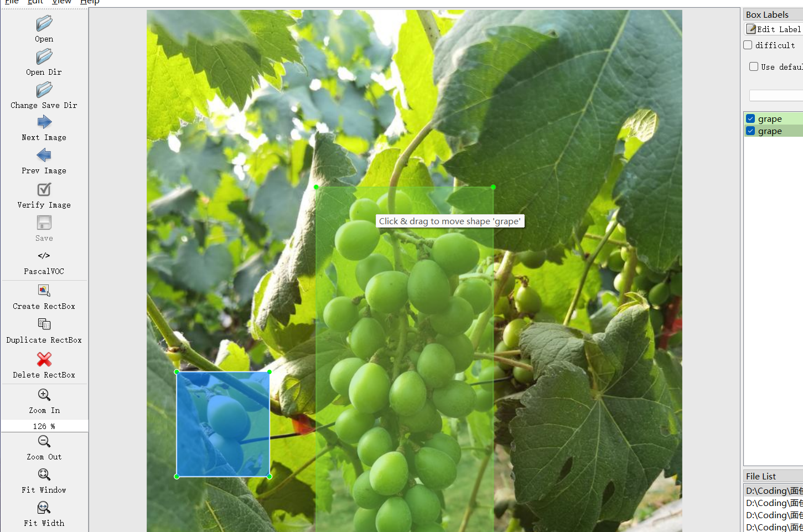

# Grape Detection - Target Detection Dataset

Dataset Information Introduction: A total of 1,646 images and corresponding annotation files are included.
Annotation files come in two formats: the VOC format's XML file and the YOLO format's .txt file.
The objects to be detected include the following:
['grape']
The number of bounding box information is as follows: (When labeling, it is usually labeled in English, and the Chinese provided in parentheses serves as a reference)
grape: 3212 (Grape fruit)
Note: One image may contain multiple objects, so the total number of bounding boxes may exceed the number of images.
The complete dataset consists of three folders and one .txt file:
all_images folder stores the dataset's images, with screenshots shown below:
Image size information:
all_txt folder and classes.txt: store the YOLO format's .txt annotation files, in the same quantity as the images, each annotation file corresponds to an image.
classes.txt:
For a detailed understanding of the standard file in the YOLO format, please search for it yourself on Baidu. In short, index 0 represents the name at position 0 in the array in classes.txt.
all_xml folder: The VOC format's XML annotation file.
The quantity matches that of the images, each annotation file corresponds to an image.
For a detailed understanding of the standard file in the VOC format, please search for it yourself on Baidu.
Both formats of annotation can be used, choose either one accordingly.
Annotation screenshots:

## Images

Here is a pay link on Stripe ( https://buy.stripe.com/3cs8yP7sY87d0vu9AB ). Please contact me lonlonago@foxmail.com after funding $89, and I will send you a complete data files , thank you!

